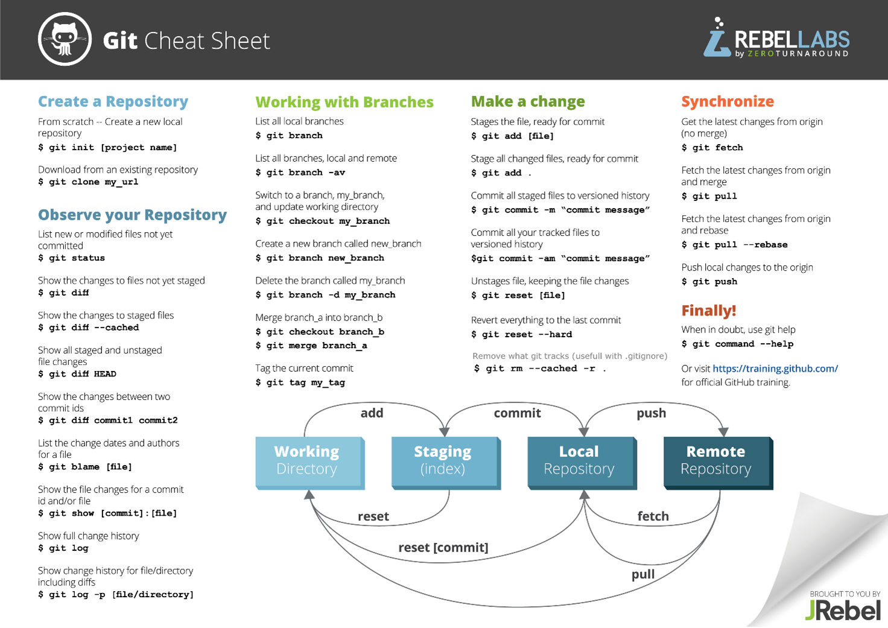

# gitdemo

## Here you see a cheat sheet for git commands:

Always remember to do the following command, before working on new stuff!

`git pull`



### Java

This is the first Java statement I learned at KEA:
```java
System.out.print("Hello world");  
``` 
